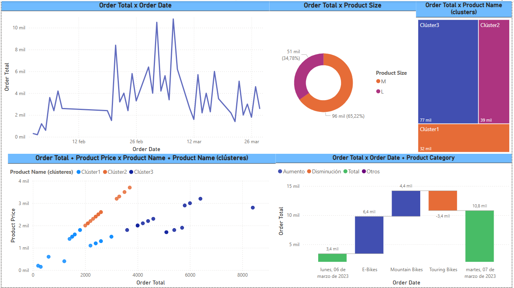

# Explaining the Increase in Sales

## Introduction
This project uses Power BI's Analyze feature to explain unexpected sales spikes and generate actionable insights. By leveraging clustering, line charts, and automated visualizations, it identifies factors contributing to sales increases.

## Steps Overview

1. **Download Data**: Load the `Adventure Works Sales Report.pbix` into Power BI Desktop.
2. **Identify Sales Spikes**: 
   - Use a line chart (Order Date: X-axis, Order Total: Y-axis) to locate sales spikes on March 3 and March 7.
3. **Apply Clustering**: 
   - Create a scatter chart and cluster data using Product Name, Order Total, and Product Price. 
4. **Analyze Sales Spikes**: 
   - Right-click March 7 on the line chart, select `Analyze > Explain the increase` to identify key drivers (e.g., Product Size, Product Category).
5. **Visualize Insights**: 
   - Add donut charts, treemaps, and other visualizations to present differences in clusters and categories effectively.
6. **Refine Report**: 
   - Adjust visualizations to fit the canvas and meet presentation standards.

## Key Outcomes
- **Insights on Sales Spikes**: Identified key drivers such as Product Size, Product Category, and Product Cluster.
- **Data Visualization**: Enhanced report with clustered scatter charts, line charts, donut charts, and treemaps.
- **Actionable Feedback**: Provided recommendations to improve future sales performance.

## Visualizations
- Placeholder for the main chart:
  
  

## Conclusion
This exercise showcases how Power BI’s Analyze feature aids in deriving insights from sudden sales increases. The report highlights valuable patterns and provides decision-making tools for the Adventure Works management team.

